<div align="center">

<picture>
  <source media="(prefers-color-scheme: dark)" srcset="assets/marca/vedoo-logo-claro.svg">
  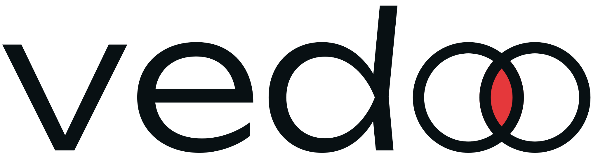
</picture>

### Portfólio de Gustavo Azevedo, designer e desenvolvedor de sites

Sites, landing pages e lojas virtuais desenhados e programados do zero, com atendimento direto no Rio de Janeiro, em Niterói, em Maricá e online.


<br>

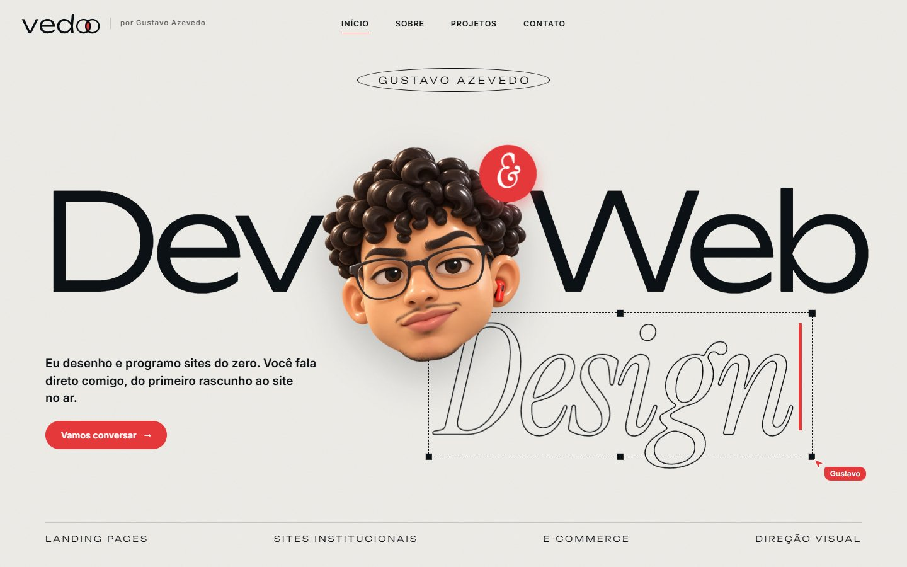

</div>

---

## Sobre o projeto

O site da **Vedoo** é o portfólio e a vitrine comercial do Gustavo. Foi feito só com **HTML, CSS e JavaScript**, sem framework, sem etapa de build e sem dependência em produção. Dá pra abrir o `index.html` direto no navegador ou publicar a pasta em qualquer hospedagem estática (Netlify, Vercel, Cloudflare Pages ou GitHub Pages).

Os projetos mostrados no portfólio são publicados junto com o site, cada um na sua pasta. Por isso eles abrem de verdade dentro de uma janela de preview, em vez de aparecerem só como imagem.

## Páginas

### Início

Capa "Dev & Web Design" com um personagem 3D que pisca, se surpreende no clique e acompanha o cursor. A palavra *Design* é digitada letra por letra e um cursor "Gustavo" redimensiona a caixa de texto, como num editor de design. Depois vêm os trabalhos em destaque, os serviços (escritos como um arquivo de código), uma faixa de tecnologias que dá pra arrastar e um quadro de conversa que leva ao contato.

<table>
  <tr>
    <td width="50%">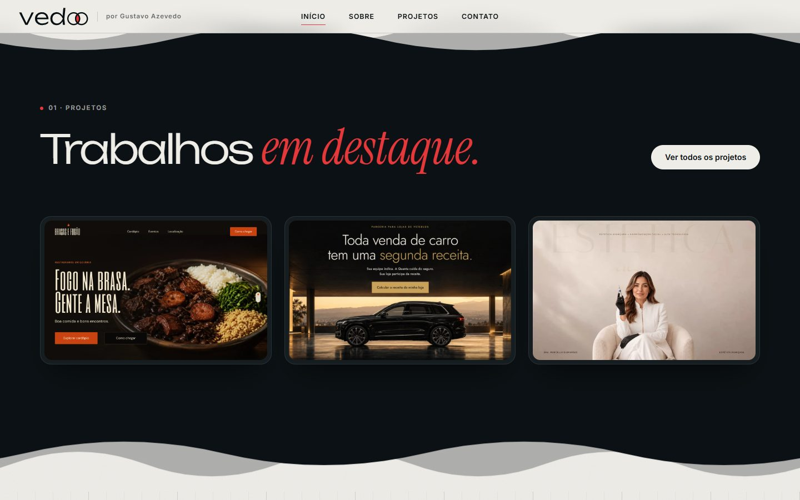</td>
    <td width="50%">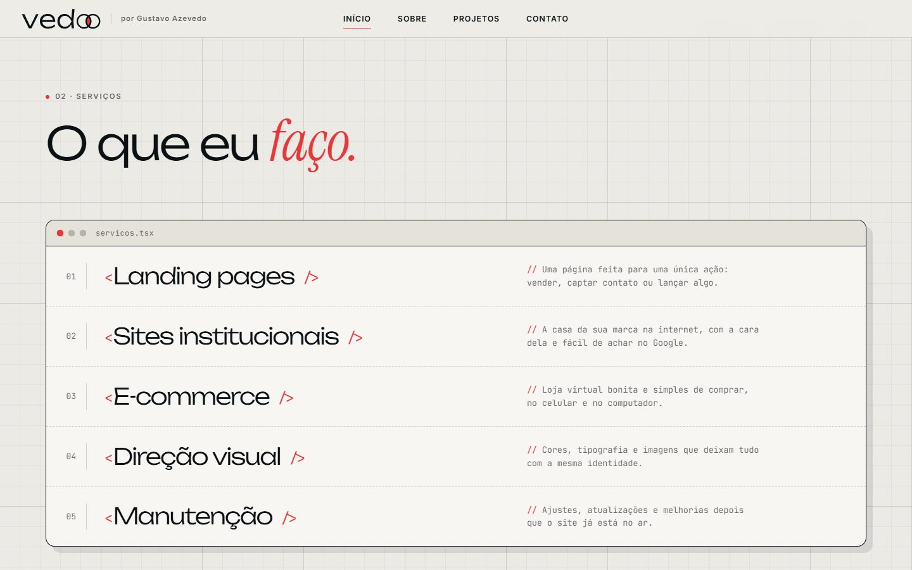</td>
  </tr>
  <tr>
    <td align="center"><sub>Trabalhos em destaque</sub></td>
    <td align="center"><sub>Serviços</sub></td>
  </tr>
</table>

### Projetos: a mesa

Os projetos ficam espalhados numa "mesa" como janelas de navegador. Dá pra arrastar as janelas, e as setas trocam o grupo de quatro. O cursor "Gustavo" passeia pela mesa e avança os projetos sozinho até a pessoa interagir. Um clique abre o site de verdade numa janela de preview, com versão para computador e celular.

<table>
  <tr>
    <td width="50%">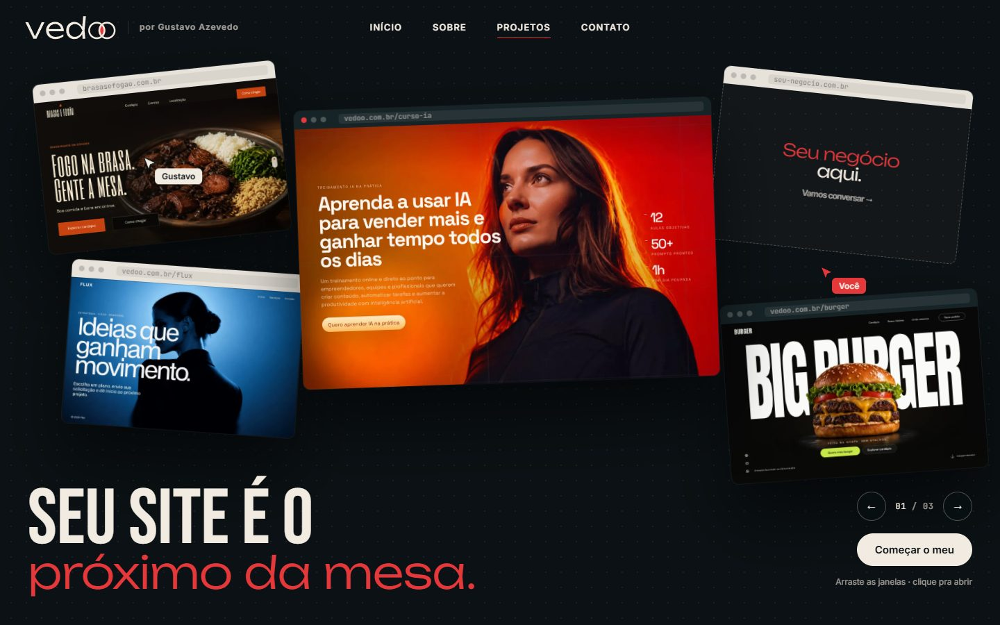</td>
    <td width="50%">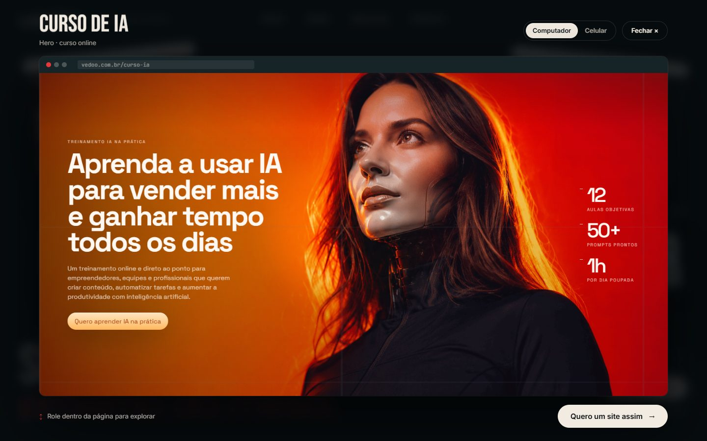</td>
  </tr>
  <tr>
    <td align="center"><sub>A mesa</sub></td>
    <td align="center"><sub>Preview de um projeto, rodando de verdade</sub></td>
  </tr>
</table>

### Sobre

Abertura "Oi, eu sou o Gustavo.", seguida de "Metade designer, metade dev.": o layout desenhado e o site pronto ficam lado a lado, separados por uma barra que dá pra arrastar. Depois vem um varal de polaroids com a rotina fora da tela e o currículo, com crachá pendurado, folha resumida e o PDF completo para baixar.

<table>
  <tr>
    <td width="50%">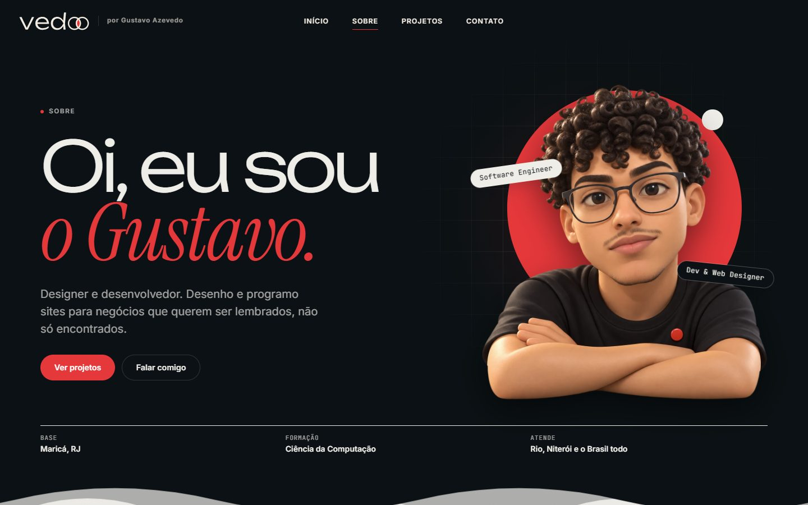</td>
    <td width="50%">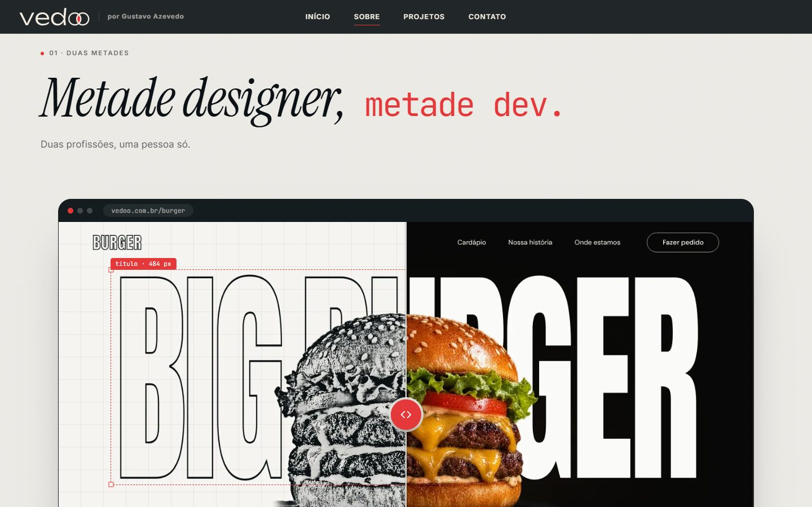</td>
  </tr>
  <tr>
    <td align="center"><sub>Abertura</sub></td>
    <td align="center"><sub>Duas metades: rascunho × site pronto</sub></td>
  </tr>
  <tr>
    <td width="50%">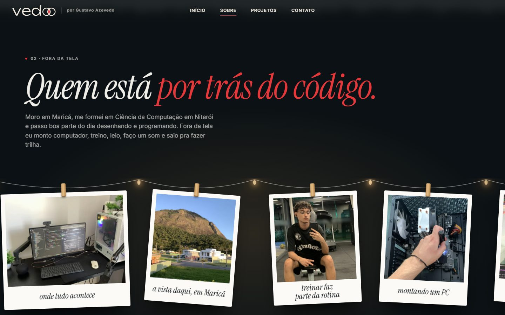</td>
    <td width="50%">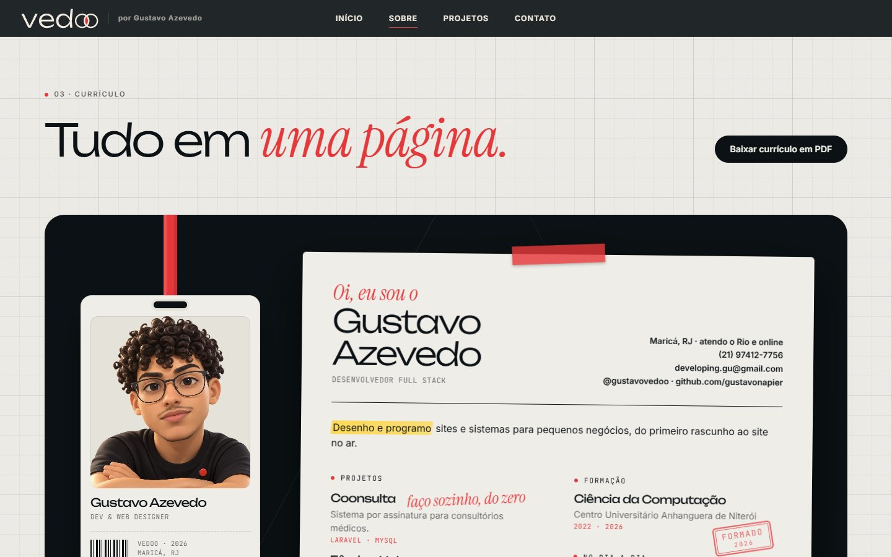</td>
  </tr>
  <tr>
    <td align="center"><sub>Fora da tela</sub></td>
    <td align="center"><sub>Currículo</sub></td>
  </tr>
</table>

### Contato

Em vez de formulário, uma conversa em formato de chat, uma pergunta por vez. No fim, a mensagem já sai escrita para o WhatsApp. WhatsApp, e-mail e Instagram também ficam disponíveis direto.

<table>
  <tr>
    <td width="50%">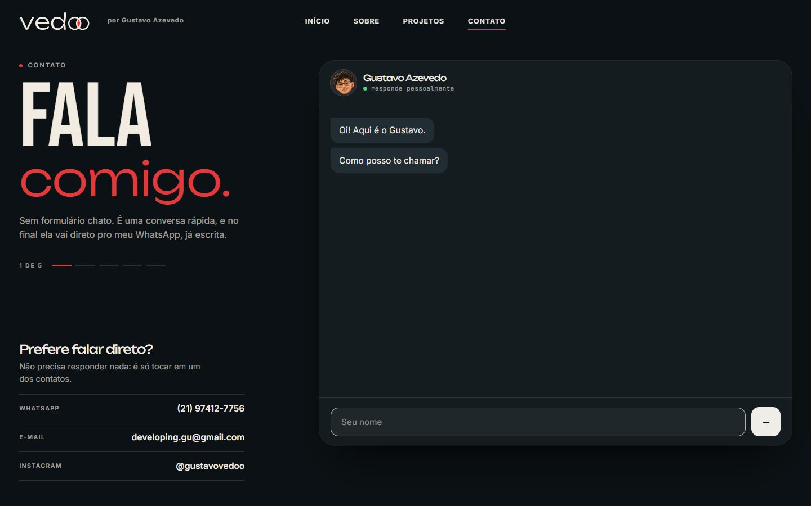</td>
    <td width="50%">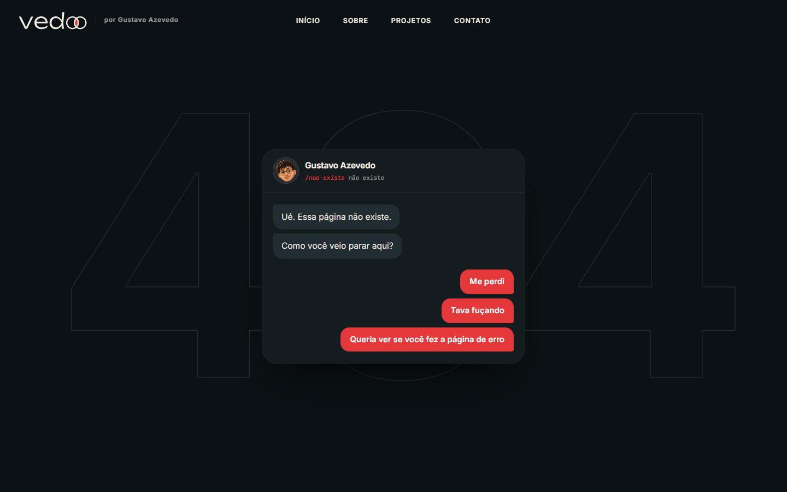</td>
  </tr>
  <tr>
    <td align="center"><sub>Contato</sub></td>
    <td align="center"><sub>Página 404, que também conversa</sub></td>
  </tr>
</table>

### No celular

Todas as páginas foram pensadas também para o celular. A capa empilha, a mesa vira um carrossel e o menu abre em tela cheia.

<p align="center">
  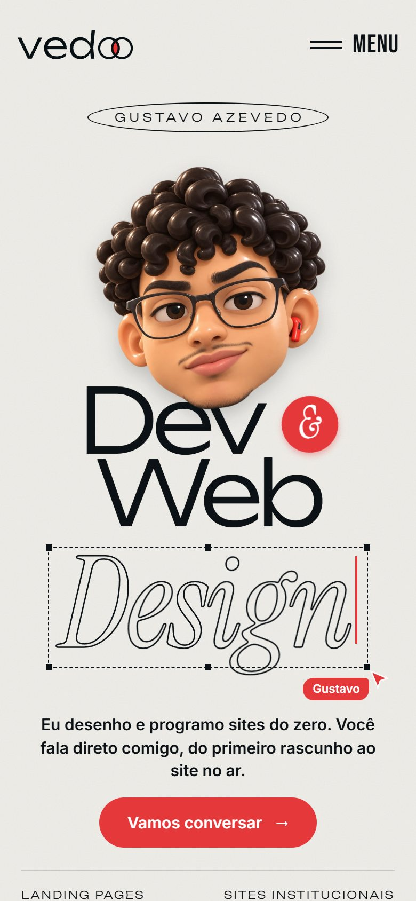
  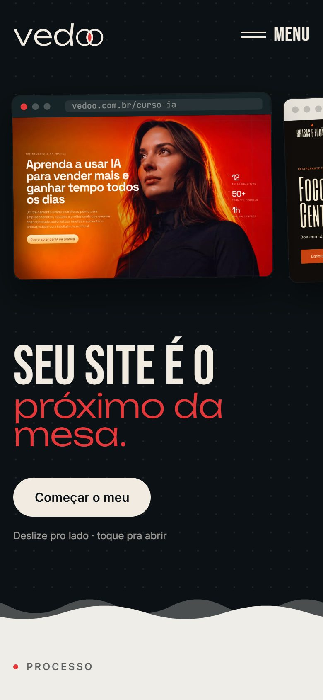
  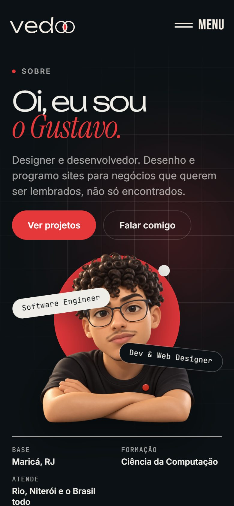
  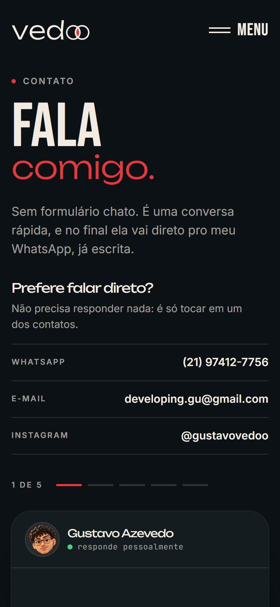
</p>

## Projetos no portfólio

A lista fica em [`projects.js`](projects.js). Os projetos com pasta própria são publicados junto com o site.

| Projeto | Tipo | Onde está |
|---|---|---|
| Brasas e Fogão | Site institucional · restaurante | [brasasefogao.com.br](https://brasasefogao.com.br/) (site do cliente) |
| Quanta Corp | Landing page · simulador de receita | em breve |
| Burger | Landing page · hamburgueria | `burger/` (React + Vite, versão compilada) |
| Cauda Leve Vet | Site institucional · veterinária | `vet/` |
| Curso de IA | Hero · curso online | `conceitos/curso-ia/` |
| Flux | Hero · agência criativa | `conceitos/flux/` |
| Jardim de Luz | Hero · galeria de arte | `conceitos/jardim-de-luz/` |
| Revelar Estético | Hero · clínica de estética | `conceitos/estetica-revelacao/` |
| Branding em Pixels | Hero · identidade visual | `conceitos/branding-pixels/` |
| Aurea Residences | Hero · imóveis | `conceitos/aurea/` |
| Dra. Sofia Miranda | Hero · odontologia | `conceitos/dra-sofia/` |
| White Reveal | Hero · posicionamento de marca | `conceitos/white-reveal/` |
| Synapse OS | Hero · tecnologia | `conceitos/synapse-os/` |

## Tecnologias

- **HTML, CSS e JavaScript puros**, sem framework nem build.
- **GSAP + ScrollTrigger** e **Lenis**, servidos localmente em `assets/vendor/`, para as animações ligadas à rolagem. Sem eles, o site continua funcionando só com CSS.
- **View Transitions** para o fade curto entre páginas, nos navegadores que suportam.
- **Fontes locais**: Unbounded, Inter, Instrument Serif, Bebas Neue e JetBrains Mono, todas com licença OFL.
- **Acessibilidade**: respeita o "reduzir movimento" do sistema, e a comparação rascunho × site pronto funciona pelo teclado (é um `input type="range"`).
- **SEO**: título, descrição, `canonical`, Open Graph, dados estruturados (`ld+json`), `robots.txt` e `sitemap.xml`.

## Rodar localmente

Precisa de [Node.js](https://nodejs.org/) só para o servidor de desenvolvimento.

```sh
git clone https://github.com/gustavonapier/vedoo-portfolio.git
cd vedoo-portfolio
npm start
```

Depois é só acessar **http://127.0.0.1:4173**. O servidor local também aceita URLs limpas (`/projetos`, `/gustavo`, `/contato`) e mostra a página 404.

## Publicar

O site vai pro ar no **Cloudflare Workers**, só com arquivos estáticos (configuração em [`wrangler.jsonc`](wrangler.jsonc) e cabeçalhos em [`_headers`](_headers)).

```sh
npm install
npm run build     # monta a pasta dist/ só com o que vai pro ar
npm run preview   # testa localmente igual a como fica no ar
npm run deploy    # publica
```

Página ou pasta nova no site precisa entrar na lista do [`ferramentas/montar-site.mjs`](ferramentas/montar-site.mjs), senão fica fora da `dist/`.

## Estrutura

```
├── index.html          Início
├── projetos.html       Projetos (a mesa)
├── gustavo.html        Sobre (/gustavo)
├── contato.html        Contato
├── 404.html            Página de erro
├── projects.js         Lista de projetos
├── styles.css          Identidade, layout e versão mobile
├── app.js              Cabeçalho, menu e revelação das seções
├── assets/
│   ├── js/             mesa, preview, conversa, motion, gustavo, 404
│   ├── gustavo/        Personagem 3D, fotos e currículo em PDF
│   ├── projetos/       Capas dos projetos
│   ├── mesa/           Prints de página inteira usados na mesa
│   ├── marca/          Logo e avatar da Vedoo
│   ├── fonts/          Fontes locais
│   └── vendor/         GSAP, ScrollTrigger e Lenis
├── burger/  vet/  conceitos/   Projetos publicados junto com o site
├── ferramentas/        Scripts: montar a dist/ e gerar o escala-desktop.css
├── wrangler.jsonc      Publicação no Cloudflare Workers
├── docs/               Prints do README e notas de manutenção
└── server.cjs          Servidor local (só desenvolvimento)
```

Os detalhes de cada página, o que editar e onde, e as regras de SEO e escala estão em **[docs/MANUTENCAO.md](docs/MANUTENCAO.md)**.

## Contato

<div align="center">

**Gustavo Azevedo** · Maricá, RJ

[Instagram @gustavovedoo](https://instagram.com/gustavovedoo) · [developing.gu@gmail.com](mailto:developing.gu@gmail.com) · [GitHub](https://github.com/gustavonapier)

</div>
